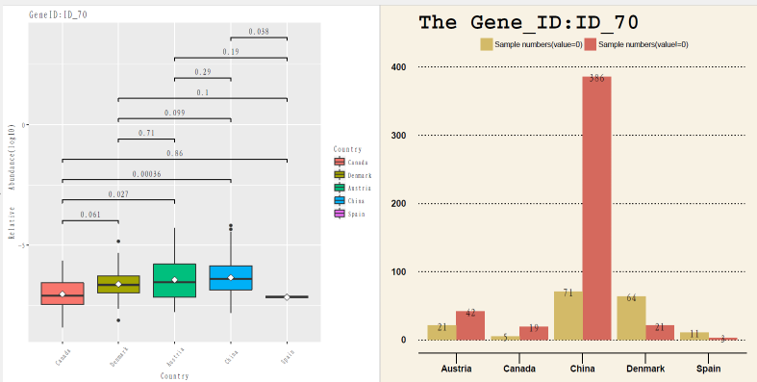
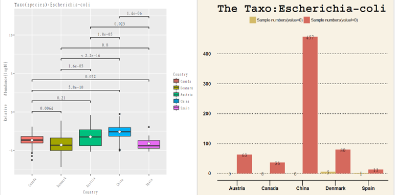

# MSV
宏基因数据统计可视化自动分析流程(Metagenomics Stat and Visual)

##本分析流程(无其他软件的调用)主要用于基于宏基因丰度数据的相关分析，可应用于如下场景:  
###背景###: 
----1.当前有n样本，比对IGC后生成这n个样本的丰度矩阵 
----2.有k个课题基因(如肠道微生物药物代谢酶基因，抗生素基因等)  
###目的###: 
----1.从样本丰度矩阵中提取出这些基因，用于后续分析(降维，相当于特征提取) 
----2.想要研究清楚这些基因在这些样本(不同表型)中的分布情况，比如在不同地区这些基因的分布情况，不同疾病里这些基因的分布情况  
###结果###: 
----1.降维后的丰度矩阵  
----2.不同表型(疾病or地区等)分布的人群中，k个课题基因分布箱线图 

----图表展示1:不同地区某微生物药物代谢基因分布

  

 
----图表展示2:不同地区某微生物药物代谢物种分布

  

